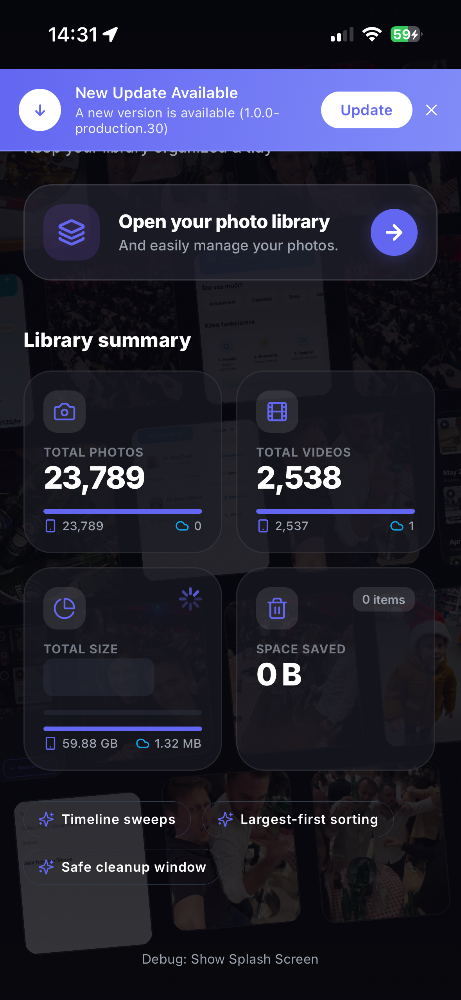
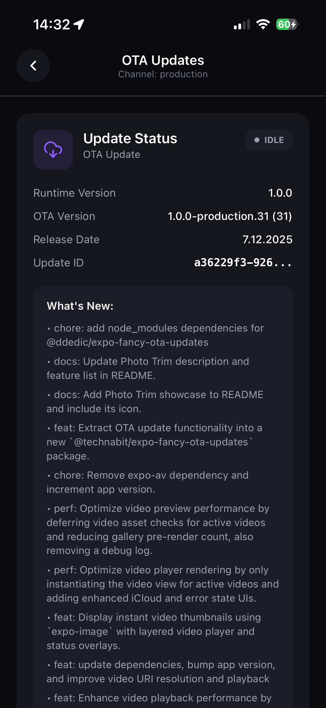
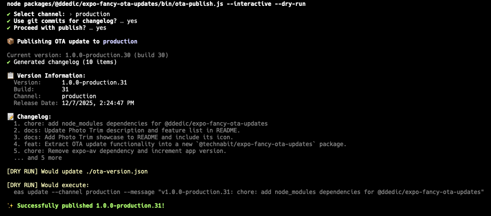
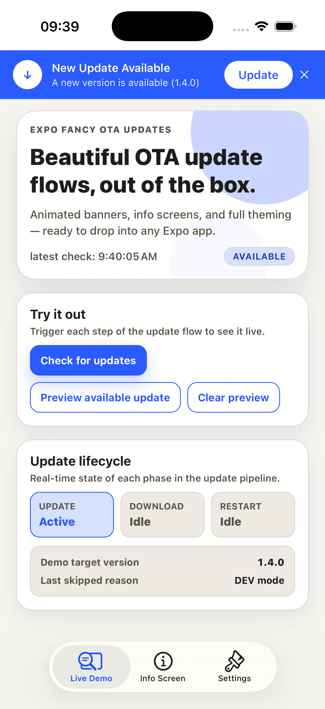
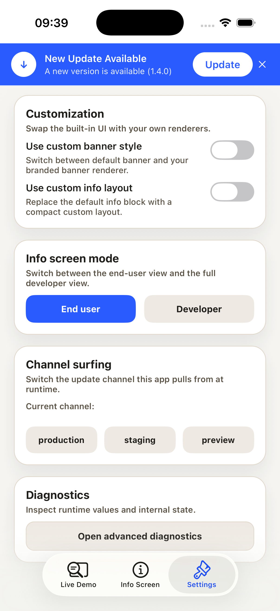

# @ddedic/expo-fancy-ota-updates

A highly customizable OTA (Over-The-Air) update UI package for Expo apps. Includes animated banners, info screens, and full theming support.


[](https://www.npmjs.com/package/@ddedic/expo-fancy-ota-updates)
[](https://opensource.org/licenses/MIT)
[](https://ddedic.github.io/expo-fancy-ota-updates/)

**[📚 Full Documentation](https://ddedic.github.io/expo-fancy-ota-updates/)** | **[📦 npm Package](https://www.npmjs.com/package/@ddedic/expo-fancy-ota-updates)** | **[💻 GitHub](https://github.com/ddedic/expo-fancy-ota-updates)**


---

<div align="center">

<table width="100%" border="0" cellspacing="0" cellpadding="0">
<tr>
<td align="center" style="border: 1px solid #30363d; border-radius: 12px; padding: 20px; background-color: #0d1117; color: #c9d1d9;">

<br/>
<h3 style="margin-bottom: 10px; border: none; color: #c9d1d9;">🏆 Proudly Used In</h3>

<a href="https://www.photo-trim.com">

</a>

<h2 style="margin-top: 15px; margin-bottom: 5px; border: none;">
<a href="https://www.photo-trim.com" style="text-decoration: none; color: #58a6ff;">Photo Trim — Smart Photo Library Cleaner</a>
</h2>

<p style="font-size: 16px; margin: 10px 0; color: #8b949e; font-style: italic;">
See exactly what's eating your storage — and fix it in seconds
</p>

<p width="85%" style="color: #8b949e; max-width: 600px; margin: 15px auto; line-height: 1.5;">
<strong>Photo Trim</strong> gives you complete visibility into your photo library clutter. Discover large files, old media, and forgotten videos buried in both your device and iCloud. Smart grouping and powerful filters make it effortless to identify and delete unnecessary photos and videos — reclaiming gigabytes of storage with just a few taps.
</p>

<br/>

<table border="0" align="center" width="100%" style="margin: 0 auto; max-width: 700px; border-collapse: separate; border-spacing: 10px;">
<tr>
<td align="center" width="33%" style="padding: 10px; border: 1px solid #30363d; border-radius: 8px;">📊<br/><b style="color: #c9d1d9;">Storage Insights</b><br/><sub style="color: #8b949e;">See what's cluttering device & iCloud</sub></td>
<td align="center" width="33%" style="padding: 10px; border: 1px solid #30363d; border-radius: 8px;">🔍<br/><b style="color: #c9d1d9;">Sort by Size</b><br/><sub style="color: #8b949e;">Find large photos & videos instantly</sub></td>
<td align="center" width="33%" style="padding: 10px; border: 1px solid #30363d; border-radius: 8px;">☁️<br/><b style="color: #c9d1d9;">iCloud vs Device</b><br/><sub style="color: #8b949e;">Clear visibility of where files live</sub></td>
</tr>
<tr>
<td align="center" width="33%" style="padding: 10px; border: 1px solid #30363d; border-radius: 8px;">📅<br/><b style="color: #c9d1d9;">Filter by Date</b><br/><sub style="color: #8b949e;">Target old, forgotten media</sub></td>
<td align="center" width="33%" style="padding: 10px; border: 1px solid #30363d; border-radius: 8px;">🗑️<br/><b style="color: #c9d1d9;">Batch Delete</b><br/><sub style="color: #8b949e;">Clean up hundreds in one tap</sub></td>
<td align="center" width="33%" style="padding: 10px; border: 1px solid #30363d; border-radius: 8px;">🔒<br/><b style="color: #c9d1d9;">Privacy First</b><br/><sub style="color: #8b949e;">All analysis stays on your device</sub></td>
</tr>
</table>

<br/>

<a href="https://www.photo-trim.com" style="text-decoration: none; font-weight: bold; font-size: 16px;">🌐 Visit photo-trim.com</a>
&nbsp;&nbsp;·&nbsp;&nbsp;
<a href="https://apps.apple.com/app/id6755884114" style="text-decoration: none; font-weight: bold; font-size: 16px;">📱 Download on App Store</a>

<br/><br/>

</td>
</tr>
</table>

</div>

---

## ✨ Features

### UI Components

- 🎨 **Fully Customizable** — Theme colors, gradients, border radius, and animations
- 🌍 **i18n Ready** — Pass your own translations or use English defaults
- ✨ **Animated Banner** — Beautiful gradient banner with pulse animation
- 🧱 **Gradient Fallback** — Uses solid background automatically when `expo-linear-gradient` is not installed
- 📱 **Info Screen** — Full debug/info screen with changelog display
- 🔌 **Drop-in Ready** — Works out of the box with sensible defaults
- 🎯 **Render Props** — Override any component with your own implementation
- 🎨 **Icon Support** — Uses lucide-react-native with text fallbacks
- 📡 **Channel Surfing** — Switch update channels at runtime (Expo SDK 54+)

### CLI Publishing Tool

- 🚀 **Easy Publishing** — Simple `ota-publish` command to publish OTA updates
- ⚙️ **Configurable** — Customize via `ota-updates.config.js`
- 📊 **Multiple Version Strategies** — Semver, build number, or date-based
- 📝 **Smart Changelog** — Auto-generate from git, manual input, file, or custom hook
- 🧩 **Per-Channel Templates** — Channel-specific version/message formats
- ✂️ **Short Channel Aliases** — Use `{channelAlias}` for compact versions like `1.1.6-p42`
- 🎯 **Interactive Mode** — Guided prompts for easy publishing
- 🔍 **Dry Run** — Preview changes before publishing
- 🪝 **Hooks System** — Run custom logic and override changelog/message/version
- 📦 **Multi-Channel** — Support for dev, preview, production channels
- ↩️ **Revert Command** — Safely republish a previous update to roll back a channel
- ⇄ **Promote Command** — Copy an update group from one channel to another

---

## 📸 Screenshots

<div align="center">

### UI Components in Action

<table>
<tr>
<td width="33%" align="center">
  
  <br/>
  <sub><b>Animated Update Banner</b></sub>
  <br/>
  <sub>Beautiful gradient with pulse animation</sub>
</td>
<td width="33%" align="center">
  
  <br/>
  <sub><b>Download Progress</b></sub>
  <br/>
  <sub>Real-time download status</sub>
</td>
<td width="33%" align="center">
  
  <br/>
  <sub><b>OTA Info Screen</b></sub>
  <br/>
  <sub>Full debug & version details</sub>
</td>
</tr>
</table>

### CLI Publishing Tool



<sub><b>Interactive CLI</b> — Publish OTA updates with guided prompts, version tracking, and changelog generation</sub>

</div>

---

## 📦 Installation

```bash
# Using pnpm
pnpm add @ddedic/expo-fancy-ota-updates

# Using npm
npm install @ddedic/expo-fancy-ota-updates

# Using yarn
yarn add @ddedic/expo-fancy-ota-updates
```

### Peer Dependencies

The following dependencies are required:

```bash
pnpm add expo expo-updates expo-device react react-native react-native-reanimated react-native-safe-area-context
```

Optional dependencies for enhanced visuals:

```bash
# For gradient banners (optional; falls back to solid View if missing)
pnpm add expo-linear-gradient

# For beautiful icons (recommended)
pnpm add lucide-react-native react-native-svg
```

---

## 🚀 Quick Start

### 1. Create Version File

Create an `ota-version.json` file in your project root (this gets updated by your OTA publishing workflow):

```json
{
  "version": "1.0.0",
  "buildNumber": 1,
  "releaseDate": "2026-01-01T00:00:00.000Z",
  "changelog": ["Initial release"]
}
```

### 2. Wrap Your App

```tsx
// App.tsx or _layout.tsx
import { 
  OTAUpdatesProvider, 
  UpdateBanner 
} from '@ddedic/expo-fancy-ota-updates';
import versionData from './ota-version.json';

export default function App() {
  return (
    <OTAUpdatesProvider config={{ versionData }}>
      {/* Banner auto-shows when update is available */}
      <UpdateBanner />
      
      {/* Your app content */}
      <YourApp />
    </OTAUpdatesProvider>
  );
}
```

That's it! The banner will automatically appear when an OTA update is detected.

---

## 📚 Documentation

**[📖 View Full Documentation →](https://ddedic.github.io/expo-fancy-ota-updates/)**

Comprehensive documentation with guides, examples, and API reference:

- **[Getting Started](https://ddedic.github.io/expo-fancy-ota-updates/getting-started)** — Quick setup guide
- **[UI Components](https://ddedic.github.io/expo-fancy-ota-updates/ui-components/provider)** — Provider, Banner, Info Screen, Hook
- **[CLI Tool](https://ddedic.github.io/expo-fancy-ota-updates/cli/overview)** — Publishing commands and configuration
- **[Guides](https://ddedic.github.io/expo-fancy-ota-updates/guides/theming)** — Theming, i18n, Hooks
- **[Expo Showcase Demo](https://ddedic.github.io/expo-fancy-ota-updates/examples/expo-showcase)** — Full interactive Expo app preview
- **[Examples](https://ddedic.github.io/expo-fancy-ota-updates/examples/workflow)** — Complete workflows and custom UI

---

## 🧪 Expo Showcase Demo

Want to feel the package before integrating it?

Run the full demo app from this repo:

```bash
pnpm install
pnpm --dir examples/demo start
```

It demonstrates:
- dynamic provider controls (`minCheckIntervalMs`, `recordSkippedChecks`, foreground checks)
- runtime channel switching ("channel surfing") with interactive UI
- default and custom banner renderers
- `OTAInfoScreen` in modal mode
- `OTAInfoScreen` in tab mode with native-header coordination
- iOS native-tabs compatibility fallback strategy
- live telemetry via `useOTAUpdates()`

<div align="center">
<table>
<tr>
<td width="33%" align="center">
  
  <br/>
  <sub><b>Live Demo</b></sub>
  <br/>
  <sub>Update banner, status, and lifecycle controls</sub>
</td>
<td width="33%" align="center">
  
  <br/>
  <sub><b>Info Screen</b></sub>
  <br/>
  <sub>Version details, changelog, and update actions</sub>
</td>
<td width="33%" align="center">
  
  <br/>
  <sub><b>Settings</b></sub>
  <br/>
  <sub>Customization, mode toggle, and channel surfing</sub>
</td>
</tr>
</table>
</div>

**📖 Demo Docs:** [Expo Showcase Demo](https://ddedic.github.io/expo-fancy-ota-updates/examples/expo-showcase)

---

## 📡 Channel Surfing

Switch the update channel your app pulls from at runtime — perfect for letting QA/stakeholders preview updates from staging or preview channels without rebuilding.

Requires **Expo SDK 54+** (`Updates.setUpdateRequestHeadersOverride()`).

```tsx
import { useOTAUpdates } from '@ddedic/expo-fancy-ota-updates';

function ChannelPicker() {
  const { channel, isSwitchingChannel, switchChannel } = useOTAUpdates();

  const handleSwitch = async (name: string) => {
    const result = await switchChannel(name);
    if (result.isSkipped) {
      console.log('Skipped:', result.reason);
    } else if (result.success) {
      console.log(`Switched from ${result.previousChannel} to ${result.newChannel}`);
    }
  };

  return (
    <View>
      <Text>Current channel: {channel ?? 'N/A'}</Text>
      {isSwitchingChannel && <ActivityIndicator />}
      <Button title="Production" onPress={() => handleSwitch('production')} />
      <Button title="Staging" onPress={() => handleSwitch('staging')} />
      <Button title="Preview" onPress={() => handleSwitch('preview')} />
    </View>
  );
}
```

The method follows the same guard pattern as `checkForUpdate` — it skips gracefully in DEV mode, simulators, and when updates are disabled, returning a `SwitchChannelResult` with the skip reason.

---

## 🚀 CLI Publishing Tool

This package includes a powerful CLI for publishing OTA updates with version tracking.

### Quick Start

**In your project (recommended):**
```bash
# When installed in your project, just use:
npx ota-publish --channel production
```

**Global usage:**
```bash
# If running outside a project, specify the package:
npx -p @ddedic/expo-fancy-ota-updates ota-publish --channel production

# Or install globally:
pnpm add -g @ddedic/expo-fancy-ota-updates
ota-publish --channel production
```

### Using in Your App

**After publishing to npm:**
```bash
npx ota-publish --channel development
```

**For local development (before npm publish):**

Add to your `package.json`:
```json
{
  "scripts": {
    "ota:dev": "node node_modules/@ddedic/expo-fancy-ota-updates/bin/ota-publish.js --channel development",
    "ota:preview": "node node_modules/@ddedic/expo-fancy-ota-updates/bin/ota-publish.js --channel preview",
    "ota:prod": "node node_modules/@ddedic/expo-fancy-ota-updates/bin/ota-publish.js --channel production"
  }
}
```

Then run: `npm run ota:dev`, `npm run ota:preview`, or `npm run ota:prod`

### Release Management Commands

```bash
# Revert a channel to a previous update group (interactive picker)
npx ota-publish revert --channel production

# Promote from preview to production (interactive picker)
npx ota-publish promote --from preview --to production

# Safe preview first
npx ota-publish revert --channel production --dry-run
npx ota-publish promote --from preview --to production --dry-run
```

### Shorter Production Version Example

If `1.1.6-production.1` is too long, use channel aliasing:

```js
// ota-updates.config.mjs
export default {
  channelAliases: { production: 'p' },
  versionFormatByChannel: {
    production: '{major}.{minor}.{patch}-p{build}',
  },
};
```

Output: `1.1.6-p1`

**📖 [Full CLI Documentation →](./CLI.md)**

---

## 📖 API Reference

### `<OTAUpdatesProvider>`

The main provider that enables OTA update functionality throughout your app.

#### Props

| Prop | Type | Description |
|------|------|-------------|
| `children` | `ReactNode` | Your app content |
| `theme` | `Partial<OTATheme>` | Custom theme (merged with defaults) |
| `translations` | `Partial<OTATranslations>` | Custom translations (merged with defaults) |
| `config` | `OTAConfig` | Provider behavior configuration |

#### Config Options

```typescript
interface OTAConfig {
  checkOnMount?: boolean;      // Check for updates on mount (default: true)
  checkOnForeground?: boolean; // Check when app comes to foreground (default: true)
  minCheckIntervalMs?: number; // Throttle checks (default: 0)
  recordSkippedChecks?: boolean; // Update lastCheck + reason for skipped checks (default: true)
  autoDownload?: boolean;      // Auto-download when available (default: false)
  autoReload?: boolean;        // Auto-reload after download (default: false)
  versionData?: OTAVersionData; // Version info from ota-version.json
  debug?: boolean;             // Enable debug logging (default: __DEV__)
}
```

#### Full Example

```tsx
<OTAUpdatesProvider
  theme={{
    colors: {
      primary: '#6366F1',
      primaryLight: '#818CF8',
      background: '#0B0B0F',
      text: '#FFFFFF',
    },
    bannerGradient: ['#6366F1', '#818CF8'],
    borderRadius: 16,
  }}
  translations={{
    banner: {
      updateAvailable: 'New Update Available!',
      updateButton: 'Update Now',
    },
  }}
  config={{
    checkOnMount: true,
    checkOnForeground: true,
    minCheckIntervalMs: 30000,
    recordSkippedChecks: true,
    autoDownload: false,
    versionData: require('./ota-version.json'),
  }}
>
  {children}
</OTAUpdatesProvider>
```

---

### `useOTAUpdates()` Hook

Access OTA update state and actions from any component within the provider.

```tsx
import { useOTAUpdates } from '@ddedic/expo-fancy-ota-updates';

function MyComponent() {
  const {
    // State
    isUpdateAvailable,  // boolean - Update is available to download
    isDownloading,      // boolean - Currently downloading
    isDownloaded,       // boolean - Download complete, ready to apply
    status,             // 'idle' | 'checking' | 'available' | 'downloading' | 'downloaded' | 'error'
    checkError,         // Error | null
    downloadError,      // Error | null
    lastCheck,          // Date | null
    lastSkippedReason,  // string | null (DEV/simulator/throttled/disabled)
    
    // expo-updates Metadata
    currentUpdateId,    // string | null
    channel,            // string | null
    runtimeVersion,     // string | null
    isEmbeddedUpdate,   // boolean

    // Channel Switching
    isSwitchingChannel, // boolean - Channel switch in progress
    switchChannel,      // (channel: string) => Promise<SwitchChannelResult>

    // Version Data
    otaVersion,         // string - e.g., "1.0.0-production.29"
    otaBuildNumber,     // number
    otaReleaseDate,     // string - ISO date
    otaChangelog,       // string[]

    // Actions
    checkForUpdate,     // () => Promise<CheckResult>
    downloadUpdate,     // () => Promise<void>
    reloadApp,          // () => Promise<void>
    simulateUpdate,     // () => void - For testing

    // Theming
    theme,              // OTATheme
    translations,       // OTATranslations
  } = useOTAUpdates();
}
```

---

### `<UpdateBanner>`

Animated banner that appears when updates are available.

#### Props

| Prop | Type | Description |
|------|------|-------------|
| `style` | `object` | Custom container style |
| `visible` | `boolean` | Controlled visibility mode |
| `onDismiss` | `() => void` | Called when banner is dismissed |
| `renderBanner` | `(props) => ReactNode` | Custom render function |

#### Basic Usage

```tsx
// Auto-shows when update available
<UpdateBanner />
```

#### Controlled Mode

```tsx
const [showBanner, setShowBanner] = useState(false);

<UpdateBanner 
  visible={showBanner} 
  onDismiss={() => setShowBanner(false)} 
/>
```

#### Custom Render

```tsx
<UpdateBanner
  renderBanner={({ 
    isDownloaded, 
    isDownloading,
    otaVersion,
    onUpdate, 
    onRestart, 
    onDismiss,
    theme 
  }) => (
    <View style={{ backgroundColor: theme.colors.primary }}>
      <Text>{isDownloaded ? 'Ready!' : `v${otaVersion} available`}</Text>
      <Button 
        title={isDownloaded ? 'Restart' : 'Update'} 
        onPress={isDownloaded ? onRestart : onUpdate} 
      />
      <Button title="Later" onPress={onDismiss} />
    </View>
  )}
/>
```

---

### `<OTAInfoScreen>`

Full debug/info screen for OTA updates. Great for settings or debug menus.

#### Props

| Prop | Type | Description |
|------|------|-------------|
| `mode` | `'developer' \| 'user'` | Screen mode (default: 'developer') |
| `onBack` | `() => void` | Back navigation callback |
| `renderHeader` | `(props) => ReactNode` | Custom header render |
| `renderInfo` | `(props) => ReactNode` | Custom render for Info section |
| `renderActions` | `(props) => ReactNode` | Custom render for Actions section |
| `renderChangelog` | `(props) => ReactNode` | Custom render for Changelog section |
| `showRuntimeVersion` | `boolean` | Toggle runtime version visibility |
| `showOtaVersion` | `boolean` | Toggle OTA version visibility |
| `showReleaseDate` | `boolean` | Toggle release date visibility |
| `showUpdateId` | `boolean` | Toggle update ID visibility |
| `showCheckButton` | `boolean` | Toggle "Check for Updates" button |
| `showDownloadButton` | `boolean` | Toggle "Download" button |
| `showReloadButton` | `boolean` | Toggle "Reload" button |
| `showDebugSection` | `boolean` | Toggle debug actions section |
| `style` | `object` | Custom container style |

#### Usage

```tsx
import { OTAInfoScreen } from '@ddedic/expo-fancy-ota-updates';

// Simple usage
<OTAInfoScreen 
  mode="user"
  onBack={() => navigation.goBack()} 
/>

// Advanced usage with custom sections
<OTAInfoScreen
  renderInfo={({ theme }) => (
    <View style={{ padding: 20 }}>
      <Text style={{ color: theme.colors.text }}>My Custom Header</Text>
    </View>
  )}
/>
```

#### Sub-Components

You can also import sub-components directly if you want to compose your own screen:

```tsx
import { OTAUpdateInfo, OTAUpdateActions, OTAUpdateChangelog } from '@ddedic/expo-fancy-ota-updates';
```

---

## 🎨 Theming

### Theme Structure

```typescript
interface OTATheme {
  colors: {
    primary: string;           // Main brand color
    primaryLight: string;      // Lighter variant
    background: string;        // Screen background
    backgroundSecondary: string;
    backgroundTertiary: string;
    text: string;              // Primary text
    textSecondary: string;
    textTertiary: string;
    border: string;
    error: string;
    success: string;
    warning: string;
  };
  bannerGradient?: [string, string];  // Gradient start/end
  borderRadius?: number;               // Card border radius
  buttonBorderRadius?: number;         // Button border radius
  animation?: {
    duration?: number;       // Enter/exit animation (ms)
    pulseDuration?: number;  // Pulse animation cycle (ms)
  };
}
```

### Using Built-in Themes

```tsx
import { 
  OTAUpdatesProvider, 
  defaultTheme,  // Dark indigo theme
  lightTheme,    // Light theme
} from '@ddedic/expo-fancy-ota-updates';

// Use light theme
<OTAUpdatesProvider theme={lightTheme}>

// Or customize from defaults
<OTAUpdatesProvider theme={{
  ...defaultTheme,
  colors: {
    ...defaultTheme.colors,
    primary: '#10B981',
  },
}}>
```

---

## 🌍 Translations

### Translation Structure

```typescript
interface OTATranslations {
  banner: {
    updateAvailable: string;
    updateReady: string;
    downloading: string;
    versionAvailable: string;
    restartToApply: string;
    updateButton: string;
    restartButton: string;
  };
  infoScreen: {
    title: string;
    statusTitle: string;
    embeddedBuild: string;
    otaUpdate: string;
    runtimeVersion: string;
    otaVersion: string;
    releaseDate: string;
    updateId: string;
    channel: string;
    whatsNew: string;
    checkForUpdates: string;
    downloadUpdate: string;
    reloadApp: string;
    debugTitle: string;
    simulateUpdate: string;
    devMode: string;
    notAvailable: string;
    none: string;
  };
}
```

### German Example

```tsx
<OTAUpdatesProvider
  translations={{
    banner: {
      updateAvailable: 'Neue Version verfügbar',
      updateReady: 'Update bereit',
      downloading: 'Download läuft...',
      versionAvailable: 'Eine neue Version ist verfügbar',
      restartToApply: 'Neustart zum Anwenden',
      updateButton: 'Aktualisieren',
      restartButton: 'Neustart',
    },
    infoScreen: {
      title: 'OTA Updates',
      checkForUpdates: 'Nach Updates suchen',
      // ... more translations
    },
  }}
>
```

---

## 🔧 Advanced Usage

### With App Theme Integration

```tsx
import { useTheme } from './your-theme-context';

function AppProviders({ children }) {
  const { colors, isDark } = useTheme();
  
  return (
    <OTAUpdatesProvider
      theme={{
        colors: {
          primary: colors.primary,
          background: colors.background,
          text: colors.text,
          // Map your theme colors
        },
      }}
    >
      {children}
    </OTAUpdatesProvider>
  );
}
```

### With i18n Library

```tsx
import { useTranslation } from 'react-i18next';

function AppProviders({ children }) {
  const { t } = useTranslation('ota');
  
  return (
    <OTAUpdatesProvider
      translations={{
        banner: {
          updateAvailable: t('banner.updateAvailable'),
          updateButton: t('banner.updateButton'),
          // ...
        },
      }}
    >
      {children}
    </OTAUpdatesProvider>
  );
}
```

---

## 📄 License

MIT License © 2025-2026 [Danijel Dedic](mailto:dedic.d@gmail.com), [Technabit e.U.](https://technabit.at)

---

## 🤝 Contributing

Contributions are welcome! Please feel free to submit a Pull Request.
